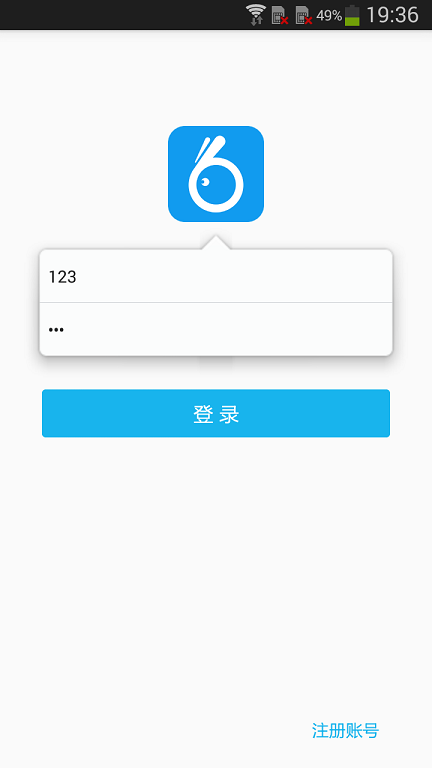
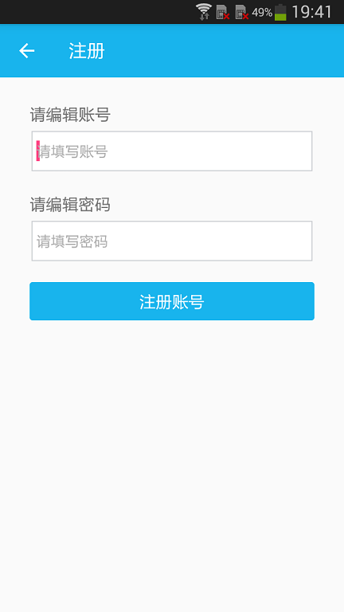
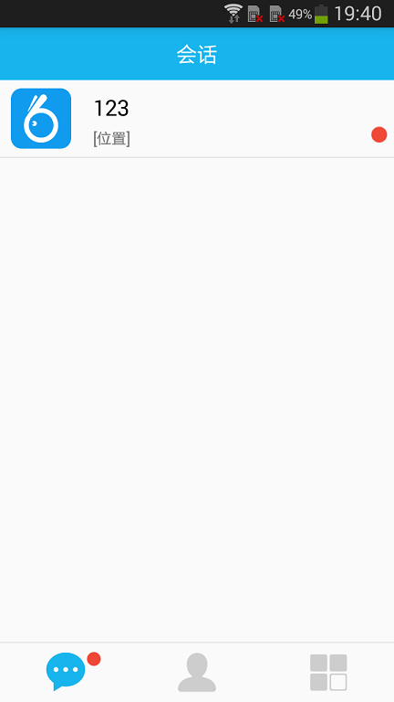
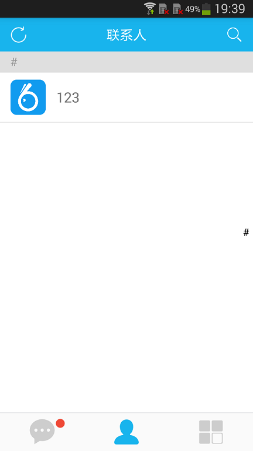
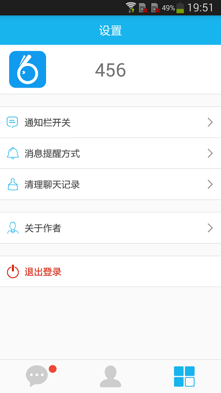
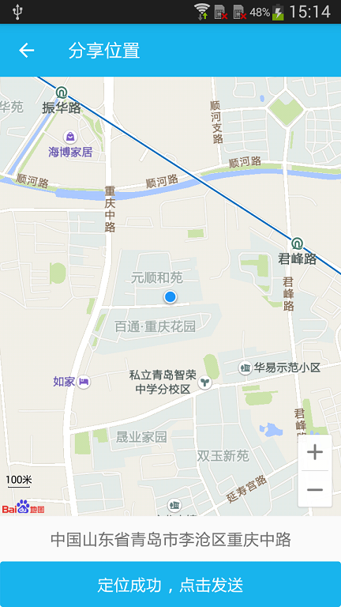

Preface
-------

1、在董相志老师的带领下，同我们几位后生一起合著了《Java网络编程案例教程（微课版）》，其中第15章由我所写，特将代码托管至此，并随着技术的发展做一些适配更新。

2、《Java网络编程案例教程（微课版）》简介
* 全书15章包含910分钟微课视频、330个习题、15个实验、206个程序实例，紧紧围绕Java网络编程的关键技术和共性技术展开介绍，每一章都以案例的设计与应用为主线，理论与实践结合。这些精心挑选的经典案例以桌面网络编程为起点，实现了从桌面网络编程到Web网络编程再到Android网络编程的三级跨越，极具应用价值。各部分内容衔接紧密，贴近实战，层层推进，相互呼应，体现了网络编程的大局观。 
* 本书内容丰富，实用性强，教学资源系统全面，每一节都有与之对应的微课视频教程，与教材完全同步，读者扫描二维码即可在线观看。 
* 本书既可作为高等院校信息技术类专业教材，也可供社会各界的信息技术人员学习参考。 

3、《Java网络编程案例教程（微课版）》链接
* 当当网：http://product.dangdang.com/25183063.html#ddclick_reco_reco_relate
* 京东商城：https://item.jd.com/12218443.html

Project Description
-------
* Theme：A simple instant messaging client, consisting of a MySQL database + Openfire server + Android client (Smack 4.19).
* Function：Register account, login and exit system, get friends list, add and delete friends, send text messages, share location information (based on Baidu map SDK).
* Support：If you have a problem or find an application error, you can submit a question here or contact me by mail. If you think this application is good, I hope you will give a "Star" to the project.

Contact Information
-------
* Author: 郭峰
* Email: iamguofeng@163.com 
* CSDN: http://blog.csdn.net/plain_maple

Application Screenshot
-------
|  Login Page | Register Page  | Session Page | Contacts Page |
|:-----------:|:--------------:|:------------:|:-------------:|
| |  |  | |

|  Settings  Page | Add Friends Page | Sharing Location Page | Chat Page |
|:---------------:|:----------------:|:---------------------:|:---------:|
| |  |  | |

# Samcker-App
