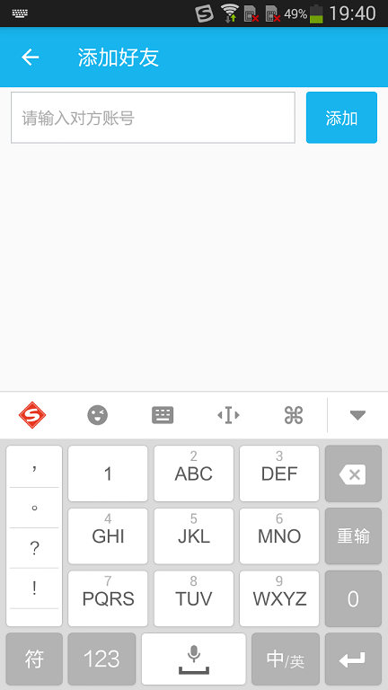

Project Description
-------
* Theme：A simple instant messaging client, consisting of a MySQL database + Openfire server + Android client (Smack 4.19).
* Function：Register account, login and exit system, get friends list, add and delete friends, send text messages, share location information (based on Baidu map SDK).
* Support：If you have a problem or find an application error, you can submit a question here or contact me by mail. If you think this application is good, I hope you will give a "Star" to the project.

Application Screenshot
-------
|  Login Page | Register Page  | Session Page | Contacts Page |
|:-----------:|:--------------:|:------------:|:-------------:|
| |  |  | |

|  Settings  Page | Add Friends Page | Sharing Location Page | Chat Page |
|:---------------:|:----------------:|:---------------------:|:---------:|
| |  |  | |

# Samcker-App
